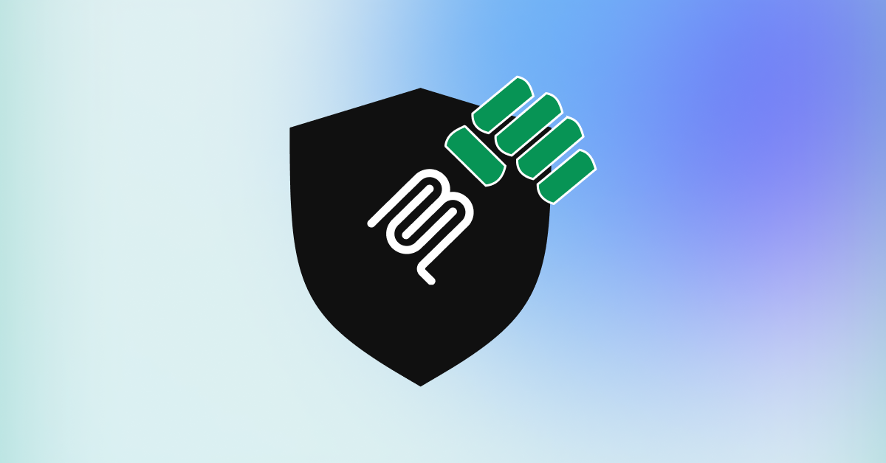

<div align="center">
  
  
  # Secure-Hulk
  
  Security scanner for Model Context Protocol servers and tools.
</div>

## Overview

Secure-Hulk is a security scanner for Model Context Protocol (MCP) servers and tools. It helps identify potential security vulnerabilities in MCP configurations, such as prompt injection, tool poisoning, cross-origin escalation, data exfiltration, and toxic agent flows.

## Features

- Scan MCP configurations for security vulnerabilities
- Detect prompt injection attempts
- Identify tool poisoning vulnerabilities
- Check for cross-origin escalation risks
- Monitor for data exfiltration attempts
- **Detect toxic agent flows** - Multi-step attacks that manipulate agents into unintended actions
- **Privilege escalation detection** - Identify attempts to escalate from public to private access
- **Cross-resource attack detection** - Monitor suspicious access patterns across multiple resources
- **Indirect prompt injection detection** - Catch attacks through external content processing
- Generate HTML reports of scan results
- Whitelist approved entities

## Installation

```bash
npm install
npm run build
```

## Usage

### Scanning MCP Configurations

```bash
# Scan well-known MCP configuration paths
npm start

# Scan specific configuration files
npm start scan /path/to/config.json

# Generate HTML report
npm start scan --html report.html /path/to/config.json

# Enable verbose output
npm start scan -v /path/to/config.json

# Output results in JSON format
npm start scan -j /path/to/config.json
```

### Using OpenAI Moderation API for Harmful Content Detection

Secure-Hulk now supports using OpenAI's Moderation API to detect harmful content in entity descriptions. This provides a more robust detection mechanism for identifying potentially harmful, unsafe, or unethical content.

To use the OpenAI Moderation API:

```bash
npm start scan --use-openai-moderation --openai-api-key YOUR_API_KEY /path/to/config.json
```

Options:

- `--use-openai-moderation`: Enable OpenAI Moderation API for prompt injection detection
- `--openai-api-key <key>`: Your OpenAI API key
- `--openai-moderation-model <model>`: OpenAI Moderation model to use (default: 'omni-moderation-latest')

The OpenAI Moderation API provides several advantages:

1. **More accurate detection**: The API uses advanced AI models to detect harmful content, which can catch subtle harmful content that pattern matching might miss.
2. **Categorized results**: The API provides detailed categories for flagged content (hate, harassment, self-harm, sexual content, violence, etc.), helping you understand the specific type of harmful content detected.
3. **Confidence scores**: Each category includes a confidence score, allowing you to set appropriate thresholds for your use case.
4. **Regular updates**: The API is regularly updated to detect new types of harmful content as OpenAI's policies evolve.

The API can detect content in these categories:

- Hate speech
- Harassment
- Self-harm
- Sexual content
- Violence
- Illegal activities
- Deception

If the OpenAI Moderation API check fails for any reason, Secure-Hulk will automatically fall back to pattern-based detection for prompt injection vulnerabilities.

### Using Hugging Face Safety Models for Content Detection

Secure-Hulk now supports Hugging Face safety models for advanced AI-powered content moderation. This provides additional options beyond OpenAI's Moderation API, including open-source models and specialized toxicity detection.

To use Hugging Face safety models:

```bash
npm start scan --use-huggingface-guardrails --huggingface-api-token YOUR_HF_TOKEN /path/to/config.json
```

Options:

- `--use-huggingface-guardrails`: Enable Hugging Face safety models for content detection
- `--huggingface-api-token <token>`: Your Hugging Face API token
- `--huggingface-model <model>`: Specific model to use (default: 'unitary/toxic-bert')
- `--huggingface-threshold <threshold>`: Confidence threshold for flagging content (default: 0.5)
- `--huggingface-preset <preset>`: Use preset configurations: 'toxicity', 'hate-speech', 'multilingual', 'strict'
- `--huggingface-timeout <milliseconds>`: Timeout for API calls (default: 10000)

Available models include:

- **unitary/toxic-bert**: General toxicity detection (recommended default)
- **s-nlp/roberta_toxicity_classifier**: High-sensitivity toxicity detection
- **unitary/unbiased-toxic-roberta**: Bias-reduced toxicity detection

Preset configurations:

- `toxicity`: General purpose toxicity detection
- `strict`: High sensitivity for maximum safety

Example with multiple guardrails:

```bash
npm start scan \
  --use-openai-moderation --openai-api-key YOUR_OPENAI_KEY \
  --use-huggingface-guardrails --huggingface-preset toxicity --huggingface-api-token YOUR_HF_TOKEN \
  --use-nemo-guardrails --nemo-guardrails-config-path ./guardrails-config \
  /path/to/config.json
```

The Hugging Face integration provides several advantages:

1. **Model diversity**: Choose from multiple specialized safety models
2. **Open-source options**: Use community-developed models
3. **Customizable thresholds**: Fine-tune sensitivity for your use case
4. **Specialized detection**: Models focused on specific types of harmful content
5. **Cost flexibility**: Various pricing options including free tiers

If the Hugging Face API check fails for any reason, Secure-Hulk will log the error and continue with other security checks.

### Inspecting MCP Configurations

```bash
npm start inspect /path/to/config.json
```

### Managing the Whitelist

```bash
# Add an entity to the whitelist
npm start whitelist tool "Calculator" abc123

# Print the whitelist
npm start whitelist

# Reset the whitelist
npm start whitelist --reset
```

## Configuration

### Scan Options

- `--json, -j`: Output results in JSON format
- `--verbose, -v`: Enable verbose output
- `--html <path>`: Generate HTML report and save to specified path
- `--storage-file <path>`: Path to store scan results and whitelist information
- `--server-timeout <seconds>`: Seconds to wait before timing out server connections
- `--checks-per-server <number>`: Number of times to check each server
- `--suppress-mcpserver-io <boolean>`: Suppress stdout/stderr from MCP servers

### Whitelist Options

- `--storage-file <path>`: Path to store scan results and whitelist information
- `--reset`: Reset the entire whitelist
- `--local-only`: Only update local whitelist, don't contribute to global whitelist

## Sponsors

<div align="center">
  <h3>Proudly sponsored by LambdaTest</h3>
  <picture>
    <source media="(prefers-color-scheme: dark)" srcset="src/assets/White_512px.png">
    <source media="(prefers-color-scheme: light)" srcset="src/assets/Black_512px.png">
    
  </picture>
</div>

## License

MIT
